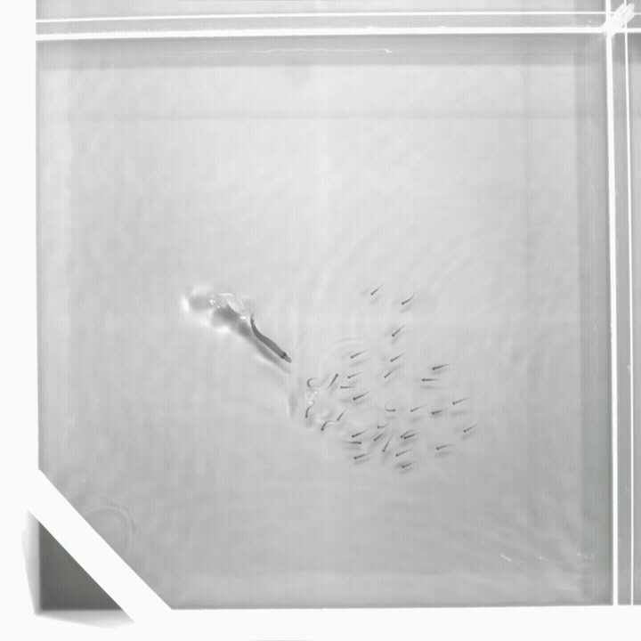
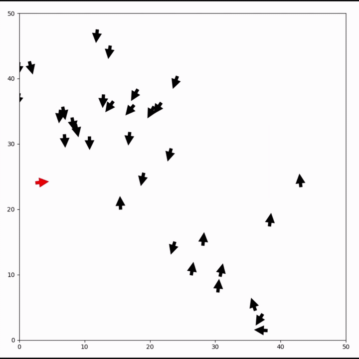
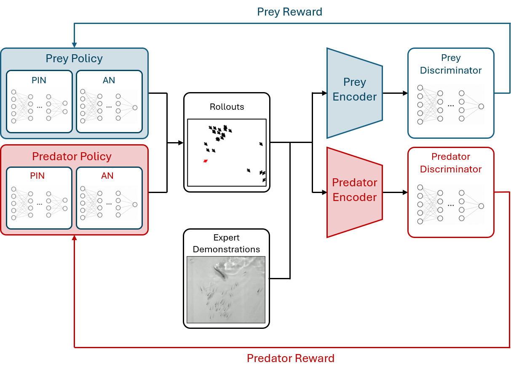
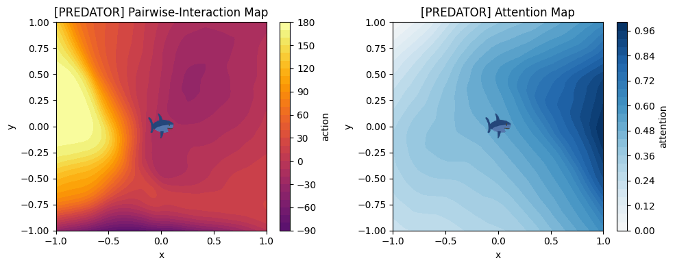

# Learning Predator–Prey Interactions from Real-World Animal Behavior 🦈🐟

This repository accompanies our paper on learning predator–prey dynamics from synthetic and real-world animal trajectories using Generative Adversarial Imitation Learning (GAIL).

The framework models predator and prey with separate role-specific policies and discriminators and applies alternating co-training to their conflicting behavioral objectives. Synthetic Couzin-based demonstrations are used for controlled verification before applying the same architecture to trajectories reconstructed from aquarium recordings.

<table>
<tr>

<td align="center" width="50%">

<a href="assets/videos/real.mp4">
  
</a>

<strong>Aquarium Recording</strong>

</td>

<td align="center" width="50%">

<a href="assets/videos/sim.mp4">
  
</a>

<strong>Policy Rollout</strong>

</td>

</tr>
</table>

<br>

## Abstract

<p align="justify">
[CHANGE AT THE END] Collective motion in swarm systems exhibits complex behavioral patterns emerging from local interactions and external influences. Learning policies that reproduce such dynamics remains challenging, especially in predator–prey settings where heterogeneous roles interact under conflicting objectives. This work investigates whether predator–prey behavior can be learned directly from demonstrations using a role-asymmetric adversarial imitation learning framework. Separate modular policies for predator and prey are trained against role-specific discriminators, while self-supervised transition encoders provide compact latent representations of trajectory dynamics. Policy optimization is performed with OpenAI Evolution Strategies and alternates between the two behavioral roles. The framework is first verified on clean synthetic trajectories generated from a Couzin-based swarm model and is subsequently applied to trajectories reconstructed from real aquarium recordings. The learned policies reproduce basic collective motion and parts of the observed predator–prey interaction structure, while sustained pursuit and coordinated avoidance remain challenging. The results highlight both the potential and the limitations of learning competitive multi-agent behavior directly from biological demonstrations.
</p>

<p align="center">
  
</p>

<br>

## Results

<p align="center">
  
</p>


## Repository Structure

```text
.
├── images/
│   └── projects/
│       ├── gail.png
│       ├── real.mp4
│       ├── sim.mp4
│       ├── maps.png
│       ├── traj.png
│       └── network.png
├── src/                 # Core implementation
├── models/              # Trained model artifacts
├── notebooks/           # Experiments and analysis
├── evaluation/          # Metrics and comparison scripts
├── requirements.txt
├── Paper.pdf
└── README.md
